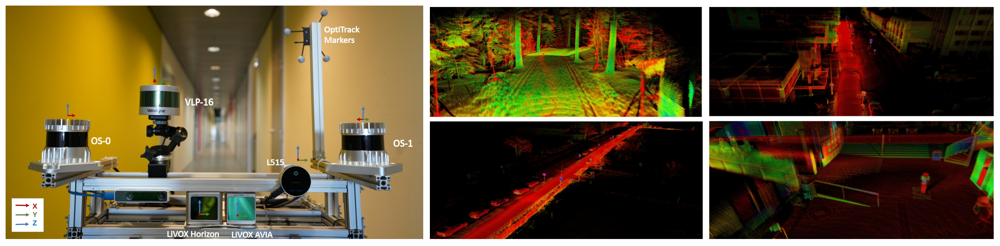
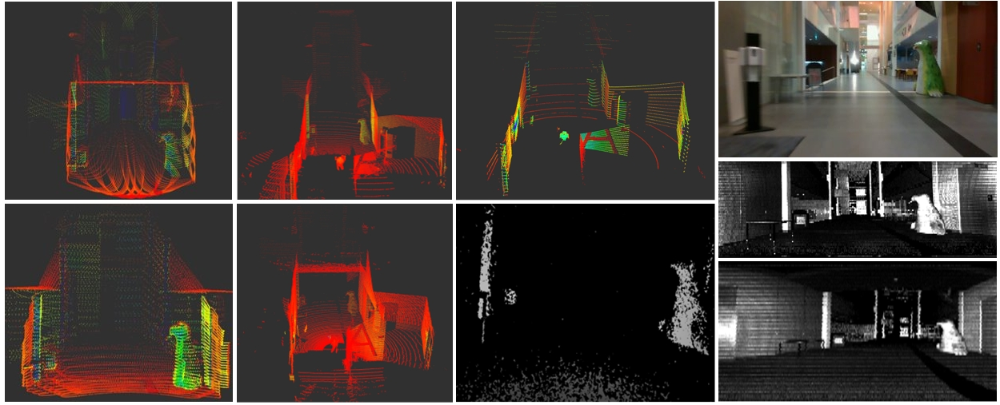
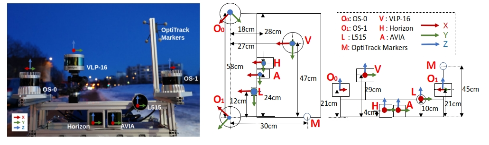
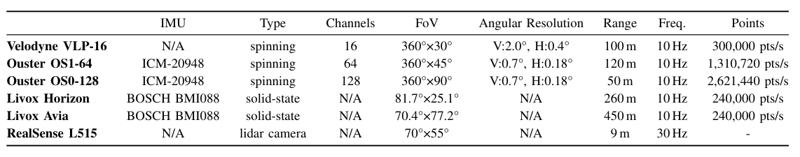
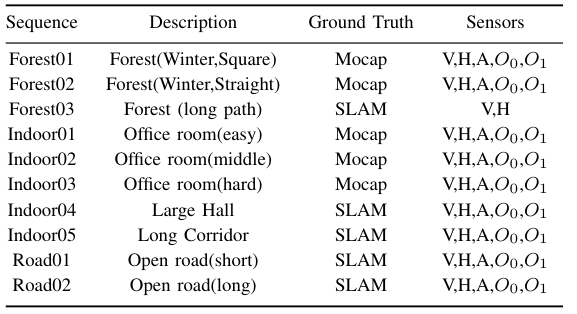
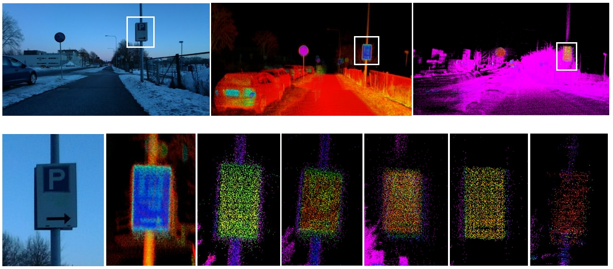
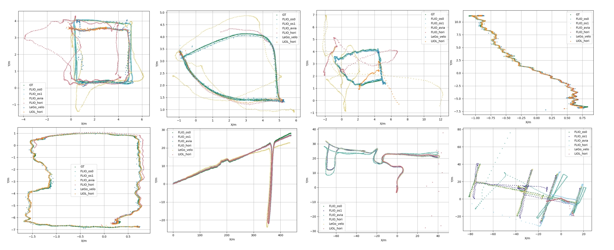
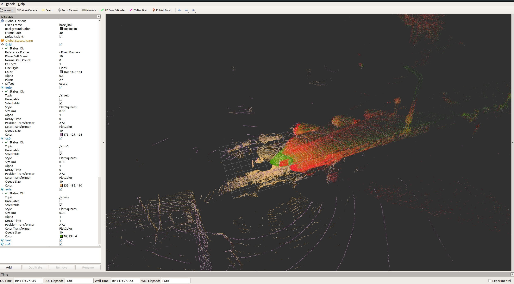

## Multi-Modal Lidars Dataset for Benchmarking General-Purpose Localization and Mapping Algorithms 

Welcome to TIERS lidars dataset! Our paper has been accepted by IEEE IROS 2022. You can check our paper [here](https://arxiv.org/pdf/2203.03454v1.pdf).

<div align=center>


</div>
<p align="left">(Left) Front view of the multi-modal data acquisition system. (Right) Samples of map data form different dataset sequences. From left to right and top to down, we display maps generated from a forest, an urban area, an open road and a large indoors hall, respectively.</p>


<div align=center>

</div>
 
<p align="left"> Our dataset was captured by a rich suite of sensors. Subsets of the data from the Indoor04 sequence are visualized here. The leftmost column shows the lidar data from Livox Avia and Horizon; the second column shows the lidar data from Ouster OS1 and OS0; the third column shows the data from the VLP-16 and depth image from L515. The rightmost column shows the RGB image from L515 and range images from 0S1 and OS0.</p>
 

Indoor data(Calibrate Sequence) |  OpenRoad SLAM example(Road02 Sequence)
:-------------------------:|:-------------------------:
  |  
Forest SLAM example(Forest01 Sequence) |  Hall SLAM example(Indoor04 Sequence)
  |  

The dataset is available at the [University of Turku servers](https://utufi.sharepoint.com/:f:/s/msteams_0ed7e9/EidIYx-aBBFCgsR0pptbzHwBeNiJZSzUBtGcPMcXEXix6w?e=g18kMN). Specific links for each sequence and for the ground truth data are available in Section 3.1 of this file.

## ABSTRACT:

We present a novel multi-modal lidar dataset with sensors showcasing different scanning modalities (spinning and solid-state), sensing technologies, and lidar cameras. The focus of the dataset is on low-drift odometry, with ground truth data available in both indoors and outdoors environments with sub-millimeter accuracy from a motion capture (MOCAP) system. For comparison in longer distances, we also include data recorded in larger spaces indoors and outdoors.The dataset contains point cloud data from spinning lidars and solid-state lidars. Also, it provides range images from high resolution spinning lidars, RGB and depth images from a lidar camera, and inertial data from built-in IMUs.

Keywords: Lidar, Dataset, Multi-modal, Multi-scenario, SLAM, Solid-state lidars

## MAIN CONTRIBUTIONS: 

   * A dataset with data from 5 different lidar sensors and one lidar camera in a variety of environments. This is, to our knowledge, the most diverse dataset in terms of lidar sensors for these environments. The dataset includes spinning lidars with 16 (Velodyne VLP-16), 64 (Ouster OS1-64) and 128 (Ouster OS1-128) channels and different vertical FoVs. Two different solid-state lidars (Livox Horizon and Livox Avia) with different scanning patterns and FoVs are also included. A lidar camera (RealSense L515) provides RGB images and lidar-aided depth images. Low-resolution images with depth, near-infrared and laser reflectivity data from the Ouster sensors complete the dataset. 

   * The dataset includes sequences with MOCAP-based ground truth in both indoors and outdoors environments. This is, to the best of our knowledge, the first lidar dataset to provide such accurate ground truth in forest environments in addition to indoor areas, albeit the limited trajectory length.


   * In addition to the MOCAP-labeled data, the dataset includes other sequences in large indoor halls, roads, and forest paths. The wide variety of sensors enables comparison between lidar odometry and mapping algorithms to an extent that was not possible before, with both general-purpose and sensor-specific approaches.

   * Based on the presented dataset, we provide a baseline comparison of the state-of-the-art in lidar odometry, localization and mapping. We compare the odometry lift as well as the quality of the maps obtained with different sensors and different algorithms.


## Updates 

2022.03.01   Initial dataset upload
 

## 1. LICENSE

This work is licensed under the MIT license and is provided for academic purpose. Please contact us at qingqli@utu.fi for further information.  

 
## 2. SENSOR SETUP

### 2.1 Data acquisition platform

Physical drawings and schematics of the sensor suite is given below. The unit of the figures is centimeter.

<div align=center>

</div>
<p align="center">Our data collecting platform, front view RGB (left), top view (middle) and front view (right).</p>


### 2.2 Sensor parameters

Sensor specification for the presented dataset. Angular resolution is configurable in the OS1-64 (varying the vertical FoV). Livox lidars have a non-repetitive scan pattern that delivers higher angular resolution with longer integration times. Range is based on manufacturerinformation, with values corresponding to 80% Lambertian reflectivity and 100 klx sunlight, except for the L515 lidar camera.
<div align=center>

</div>
 

### 2.3 ROS topics
The rostopics of our rosbag sequences are listed as follows:

* VLP-16 LIDAR : \
`/velodyne_points  sensor_msgs/PointCloud2`  
* OS0 LIDAR :  
    `/os_cloud_node/imu           : sensor_msgs/Imu  `,       
                ` /os_cloud_node/points               : sensor_msgs/PointCloud2 `, \
                `/img_node/nearir_image               : sensor_msgs/Image  ` ,      
                ` /img_node/range_image               : sensor_msgs/Image  `  ,     
                ` /img_node/reflec_image              : sensor_msgs/Image   `  ,   

* OS1 LIDAR : \
`   /os_cloud_nodee/imu        : sensor_msgs/Imu ` ,         
             `/os_cloud_nodee/points        : sensor_msgs/PointCloud2  `,           
            `/img_nodee/nearir_image          : sensor_msgs/Image `,        
            ` /img_nodee/range_image           : sensor_msgs/Image `,       
            ` /img_nodee/reflec_image       : sensor_msgs/Image `,        
            ` /img_nodee/signal_image        : sensor_msgs/Image ` ,  
* Horizon LIDAR : \
`/livox/imu : sensor_msgs/Imu`,            
                `/livox/lidar : livox_ros_driver/CustomMsg ` 
* AVIA LIDAR : \
    `/avia/livox/imu : sensor_msgs/Imu `, \
        `/avia/livox/lidar : livox_ros_driver/CustomMsg`,
* L515 LIDAR CAMERA: \
    `/cam_1/color/image_raw             : sensor_msgs/Image `,        
    `/cam_1/depth/image_rect_raw        : sensor_msgs/Image `,
* MOCAP SYSTEM:  \
    `/vrpn_client_node/optitest/pose   : geometry_msgs/PoseStamped`
 
 

## 3. DATASET SEQUENCES
  

<div align=center>

<p align="center">List of data sequences in our dataset </p>
 <p align="center">(V: Velodyne VLP-16, H:Livox Horizon, A:Livox Avia, O_0: Ouster OS0, O_1: Ouster OS1.</p>
</div>

### 3.1 Main dataset

Sequence Name|Collection Date|Total Size|Duration|Features|Rosbag|GroundTruth
--|:--|:--:|--:|--:|--:|--:
Forest01|2022-02-08|21.9g|62s|Winter,night,Square|[Rosbag](https://utufi.sharepoint.com/:u:/s/msteams_0ed7e9/ERuiTeOtX5FGs4GJPH9-DhYBQO-FUQkat3u4sSKwwpduPg?e=HfJXdP)| MOCAP [link](./data/ground_truth/forest01_optitrack.csv)
Forest02|2022-02-08|22.4g|73s|Winter,night,Straight| [Rosbag](https://utufi.sharepoint.com/:u:/s/msteams_0ed7e9/EQjHj-L7UzhMuYoD9RzAJd0BdydMpIsy1ci7sdXvfgUzsA?e=wjeCOi)|MOCAP [link](./data/ground_truth/forest02_optitrack.csv)
Forest03|2021-09-28|7.3g|717s|Autumn,forest.long|[Rosbag](https://utufi.sharepoint.com/:u:/s/msteams_0ed7e9/ESw3g6p8c8hIia1_ffZLQQoB6jz2YoZX5E5j2A8EuuxcFg?e=qU6972)| -
Indoor01(easy)|2022-04-27|49.3g|114s|day,indoor,office|[Rosbag](https://utufi.sharepoint.com/:u:/s/msteams_0ed7e9/EawwFYGOurRNlcUZfvrwEfcBlnW20VTIYCPLm5VJieeHWw?e=CLjB2n)|MOCAP [link](./data/ground_truth/indoor01_optitrack.csv)  
Indoor02(medium)|2022-02-21|16.7g|42.3s|day, indoor,office|[Rosbag](https://utufi.sharepoint.com/:u:/s/msteams_0ed7e9/EYXGcc1Z-y1FpnDwQ1geIoEBovXvLfoxZwt36J1_t2PugA?e=UwHhXd)|MOCAP [link](./data/ground_truth/indoor02_optitrack.csv)  
Indoor03(diffcult)|2021-02-21|19.2g|46.7s|day,indoor,office|[Rosbag](https://utufi.sharepoint.com/:u:/s/msteams_0ed7e9/EVGuZFh7fpBKtQSMKoGb8ncB3Aaow-UoWJnfYyiCd4V9sA?e=bteL7Y)|MOCAP [link](./data/ground_truth/indoor03_optitrack.csv)
Indoor04(Hall)|2022-02-09|92.8g|248s|day,indoor,Hall|[Rosbag](https://utufi.sharepoint.com/:u:/s/msteams_0ed7e9/EZn83qXg-FdDhg7qydCROZEBizsL1Y5V7yebYX1ihrHkhg?e=dhIKqu)|SLAM [link](./data/ground_truth/indoor04_fastlio_os128.csv)  
Indoor05(Corridor)|2022-02-09|141.5g|551s|day,indoor,corridor|[Rosbag](https://utufi.sharepoint.com/:u:/s/msteams_0ed7e9/ETHCdLaWuQBAgSIiJrveYU0BYzUwbQwQPesdvc5W5Gb2Bg?e=R8Ny4o)| SLAM [link](./data/ground_truth/indoor05_fastlio_os128.csv)
Road01|2022-02-20|47.6g|110s|day,short road|[Rosbag](https://utufi.sharepoint.com/:u:/s/msteams_0ed7e9/EdIVc56d1wVHj2oniOha6bYBWUptX7l8r3GGsd5Ur4DJfQ?e=15ILey)|-   
Road02|2022-02-20|212.7g|487s|day,long road|[Rosbag*](https://utufi.sharepoint.com/:u:/s/msteams_0ed7e9/EQU61kjdUWxNpbWnx85yqAMBY5IHPPgTlyd_JPo2lQa5kg?e=Jnszkc)|SLAM [link](./data/ground_truth/road02_fastlio_os128.csv) 


  
* Note: For sequence Road02, please decompress the rosbag first 
    ~~~
    rosbag decompress road02.bag  
    ~~~
* Note: For sequence Forest03 and Road01, the SLAM results are not provided, therefore end users can generate SLAM results. Other sequences that in MoCAP system unavailable environment, SLAM result are generated from FAST_LIO with OS0 (128 Channels) lidar.

### 3.2 Ground Truth:
The meaning of each column in ground truth files is as follows:  
~~~
timestamp, pose.position.x,  pose.position.y,  pose.position.z, roll, pitch, yaw, pose.orientation.x, pose.orientation.y, pose.orientation.z, pose.orientation.w. 
~~~

In the MOCAP system available environment, the ground truth data from the MOCAP system are recorded in rosbag. The user can generate the ground truth file by himself. A Script named 'result_sub_ros.py' is provided in the scripts folder to record the result and save it into a CSV file.
~~~
python2 result_sub_ros.py
~~~

### 3.3 Other data

Sequence Name|Collection Date|Total Size|Duration|Features|Rosbag 
--|:--|:--:|--:|--:|--:
LidarsCali|2022-02-11|21.9g|19.1s|room| [Rosbag](https://utufi.sharepoint.com/:u:/s/msteams_0ed7e9/Ea0qTMxHxR5GsHMX62HRjFMBxpdrOrp9fMSfKkxp2e5DAg?e=HmjOoT)


## 4. SLAM RESULTS 
We teseted some well-known lidar SLAM methods, which are listed below:
 
* [LeGO-LOAM](https://github.com/RobustFieldAutonomyLab/LeGO-LOAM)
 
* [FAST_LIO](https://github.com/hku-mars/FAST_LIO)

* [LIO_LIVOX](https://github.com/Livox-SDK/LIO-Livox)
 

### 4.1 Mapping quality results

<div align=center>

<p align="center">Qualitative comparison of the mapping quality. Top row showm the rgb image, map LIOL Horizon, FLIO OS0. Bottom row shows a parking signs in rgb image, and mapping result from Horizon-based LIOL, Horizon, Avia, OS0, and OS1-based FLIO, and Velodyne's LeGo-LOAM maps, respectively.</p>
</div>

### 4.22 Trajectory results
<div align=center>

<p align="center">Estimated trajectories. Top row: Indoor01, Indoor02, Indoor03, Forest02. Bottom row: Forest01, Road02, Indoor04, Indoor05.</p>
</div>
 
  
## 5. DEVELOPMENT TOOLKITS 

### 5.1 Frame_ID reset

Rosbag recoreds message with their raw frame_id. If user need to show or run multiple lidar same time, we use [srv_tools](https://github.com/srv/srv_tools) to change frame_id of each topics. To install srv_tools, please follow [srv_tools installation](https://wiki.ros.org/srv_tools).

Then follow the commands below:
~~~
cd ./scripts/                                              # Go to scripts folder
python2  change_frameid.py [inbag_path] [outbag_path]      # Specify bag path
~~~
 
Note: This script will transform the raw frame_id to new one(right) as based on topic(left) follows:
~~~
"/avia/livox/lidar"     -> "avia_frame"
"/avia/livox/imu"       -> "avia_frame" 
"/livox/imu"            -> "horizon_frame" 
"/livox/lidar"          -> "horizon_frame" 
"/os_cloud_node/points" -> "os0_sensor" 
"/os_cloud_node/imu"    -> "os0_imu"
"/os_cloud_nodee/points"-> "os1_sensor"
"/os_cloud_nodee/imu"   -> "os1_imu"  
~~~

### 5.2 Visulize Data

### 5.2.1 **Ubuntu** and **ROS**

Ubuntu 64-bit 16.04 or 18.04.
ROS Kinetic or Melodic. [ROS Installation](http://wiki.ros.org/ROS/Installation) and its additional ROS pacakge:

```
    sudo apt-get install ros-${ROS_DISTRO}-cv-bridge ros-${ROS_DISTRO}-tf ros-${ROS_DISTRO}-message-filters ros-${ROS_DISTRO}-image-transport
```

**NOTE** You need to source your ROS installation for the `$ROS_DISTRO` env variable to be defined. For example, if your use ROS-melodic, the command should be:

```
    sudo apt-get install ros-melodic-cv-bridge ros-melodic-tf ros-melodic-message-filters ros-melodic-image-transport
```

### 5.2.2 **PCL**

Follow [PCL Installation](http://www.pointclouds.org/downloads/linux.html).

### 5.2.3 **LiVOX ROS Driver**

To visualize data, we need install the Livox LiDAR SDK. Follow instructions [Livox-ros-driver installation](https://github.com/Livox-SDK/livox_ros_driver) 

### 5.2.4 **Download and compile this package**

~~~
cd ~/catkin_ws/src
git clone git@github.com:TIERS/multi-lidar-dataset.git
cd ..
catkin_make -DCATKIN_WHITELIST_PACKAGES="dataset_tools"
source /devel/setup.bash
~~~

Finally, we can visulize all data by
~~~
roslaunch dataset_tools data_show.launch
~~~ 

 
### 5.3 Evaluation

We use open-source tool [evo](https://github.com/MichaelGrupp/evo) for evalutation. 

To evaluate LIDAR SLAM, you can run: 
~~~
evo_ape tum optk.txt {SLAM_result}.txt -a -p
~~~

### 5.4 Calibration 

## Lidars Extrinsic
We provide a tool for extrinsic parameters between lidars that can calculate the extrinsic parameter based on GICP methods. As the OS0 has the highest FOV, we first rotate the coordinate of OS0 sensor 45 degrees to align its X-axis with Horizon, Avia and Velodyne. Then the rotated coordinate is treated as "base_link". All clouds from other lidar are matched with the "base_link" coordinate. For Avia, Horizon, we integrated the first five frames to increase point cloud density and reduce its low FOV impact.

To use this tools, first play one rosbag from our dataset:
~~~
rosbag play  ICT_OUT_2022-02-20-17-34-49.bag --clock
~~~
Then run our calibration launch file:
~~~
roslaunch dataset_tools lidars_extri_comp.launch
~~~

Then you can find the calculated parameter, and its transformed cloud;
~~~
OS0 -> base_link 0 0 0 0.785398       -0        0 /os0_sensor /base_link 10
OS1 -> base_link  0.0100882   0.581502 -0.0210581  2.34826  3.12619 -3.13066 /os1_sensor /base_link 10
velo -> base_link -0.164831  0.173188  0.117624 3.07795 3.09161 3.12807 /velo_sensor /base_link 10
Avia -> base_link -0.0608374    0.29663  -0.122276  0.00549421 0.000246092   -0.011555 /avia_frame /base_link 10
hori -> base_link 0.00345477   0.145195  -0.134907 3.12905 3.14022 3.12706 /hori_frame /base_link 10
~~~

The RVIZ window will be opened and show the aligned point cloud.
<div align=left>



## IMU 
For IMU intrinsics, visit [Imu_utils](https://github.com/gaowenliang/imu_utils)
 
For extrinsics between cameras and LIVOX Lidar, visit [livox_camera_lidar_calibration](https://github.com/Livox-SDK/livox_camera_lidar_calibration)  

### 5.5 Sensor details and datasheets

[Avia](https://www.livoxtech.com/avia): https://www.livoxtech.com/avia,  
[Horizon](https://www.livoxtech.com/horizon):https://www.livoxtech.com/horizon,  
[OS0](https://ouster.com/products/scanning-lidar/os0-sensor/):https://ouster.com/products/scanning-lidar/os0-sensor/,    
[OS1](https://ouster.com/products/scanning-lidar/os1-sensor/):https://ouster.com/products/scanning-lidar/os1-sensor/,   
[Vlp-16](https://velodynelidar.com/products/puck/):https://velodynelidar.com/products/puck/,     
[Realsense L515](https://www.intelrealsense.com/lidar-camera-l515/):https://www.intelrealsense.com/lidar-camera-l515/.

# Star History

[](https://star-history.com/#TIERS/tiers-lidars-dataset&Date)

## 6. ACKNOWLEGEMENT

This research work is supported by the Academy of Finland's AeroPolis project (Grant 348480) and the Finnish Foundation for Technology Promotion (Grants 7817 and 8089).

Please cite our [*Dataset* paper](https://arxiv.org/pdf/2203.03454v1.pdf) if the code or data in this repo helps your work: 
```
@article{li2022dataset,
  title={Multi-Modal Lidar Dataset for Benchmarking General-Purpose Localization and Mapping Algorithms},
  author={ Li, Qingqing and  Yu, Xianjia and Pe{\~n}a Queralta, Jorge and Westerlund, Tomi},
  journal={arXiv preprint arXiv:2203.03454},
  year={2022}
}

```
 
